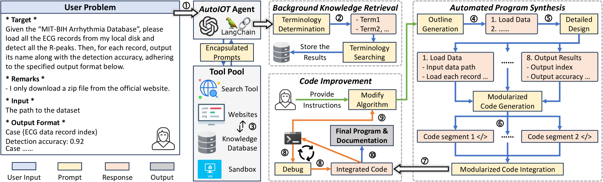

# AutoIOT: LLM-Driven Automated Natural Language Programming for AIoT Applications

[](https://lemingshen.github.io/assets/publication/conference/AutoIOT/paper.pdf) &ensp; [](https://lemingshen.github.io/projects/autoiot/) &ensp; [](https://opensource.org/licenses/MIT)

<font color='red'>A demo video can be found here: [Video](https://www.youtube.com/watch?v=E0INJT9xEWg&feature=youtu.be)</font>

The advent of Large Language Models (LLMs) has profoundly transformed our lives, revolutionizing interactions with AI and lowering the barrier to AI usage. While LLMs are primarily designed for natural language interaction, the extensive embedded knowledge empowers them to comprehend digital sensor data. This capability enables LLMs to engage with the physical world through IoT sensors and actuators, performing a myriad of AIoT tasks. Consequently, this evolution triggers a paradigm shift in conventional AIoT application development, democratizing its accessibility to all by facilitating the design and development of AIoT applications via natural language. However, some limitations need to be addressed to unlock the full potential of LLMs in AIoT application development. First, existing solutions often require transferring raw sensor data to LLM servers, which raises privacy concerns, incurs high query fees, and is limited by token size. Moreover, the reasoning processes of LLMs are opaque to users, making it difficult to verify the robustness and correctness of inference results. This paper introduces AutoIOT, an LLM-based automated program generator for AIoT applications. AutoIOT enables users to specify their requirements using natural language (input) and automatically synthesizes interpretable programs with documentation (output). AutoIOT automates the iterative optimization to enhance the quality of generated code with minimum user involvement. AutoIOT not only makes the execution of AIoT tasks more explainable but also mitigates privacy concerns and reduces token costs with local execution of synthesized programs. Extensive experiments and user studies demonstrate AutoIOT's remarkable capability in program synthesis for various AIoT tasks. The synthesized programs can match and even outperform some representative baselines.


## AutoIOT Overview



## Quick Start
### 1. Installation
```bash
pip install -r requirements.txt
```

### 2. Dataset Preparation
- Download the dataset from this [link](https://mypikpak.com/s/VOOMZ8bBd1AtByZBwyeqLvLDo1).
- Move the folder named 'AutoIOT_dataset' to the root of this project.

### Option 1
- We directly provide the generated code by AutoIOT for the heartbeat detection, IMU-based HAR, mmWave-based HAR, and multimodal HAR.
- Make sure that your PC has installed all necessary Python packages for those generated code segments.
- To implement heartbeat detection, you can try:
  ```bash
  pip install wfdb numpy scipy
  cd ./generated code
  python ECG.py --input_file "./AutoIOT_dataset/ECG"
  ```
- To implement IMU-based HAR, you can try:
  ```bash
  pip install pandas numpy scipy scikit-learn torch
  cd ./generated code
  python IMU.py --input_file "./AutoIOT_dataset/IMU/WISDM_ar_v1.1_raw.txt"
  ```
- To implement mmWave-based HAR, you can try:
  ```bash
  pip install numpy scikit-learn torch tqdm
  cd ./generated code
  python ECG.py --input_file "./AutoIOT_dataset/mmWave"
  ```
- To implement multimodal HAR, you can try:
  ```bash
  pip install numpy scikit-learn torch tqdm matplotlib seaborn
  cd ./generated code
  python ECG.py --input_file "./AutoIOT_dataset/multimodal"
  ```
- After executing these Python script, you will get the results.

### Option 2
- Here are four websites that demonstrate the executing workflow of AutoIOT, you can clearly see the intermediate results about how our AutoIOT agent interacts with various tools
  - Heartbeat detection: &nbsp;<button><a href="https://lemingshen.github.io/projects/autoiot/main_ECG.html" target="_blank">Link</a></button>
  - IMU-based HAR: &nbsp;<button><a href="https://lemingshen.github.io/projects/autoiot/main_IMU.html" target="_blank">Link</a></button>
  - mmWave-based HAR: &nbsp;<button><a href="https://lemingshen.github.io/projects/autoiot/main_mmWave.html" target="_blank">Link</a></button>
  - Multimodal HAR: &nbsp;<button><a href="https://lemingshen.github.io/projects/autoiot/main_multimodal.html" target="_blank">Link</a></button>

### Option 3
- <font color='red'>IMPORTANT</font>
  - Open `config.py`
  - Add your own key in the following two lines:
    ```python
    os.environ["OPENAI_API_KEY"] = "your key"
    os.environ["TAVILY_API_KEY"] = "your key"
    ```
  - Enter your OpenAI API key in `os.environ["OPENAI_API_KEY"]`
  - Enter your Tavily API key in `os.environ["TAVILY_API_KEY"]`
  - You can apply for Tavily API key from this [link](https://tavily.com/)
- Next, you can open the 'ipynb' files in the root and execute each code block one by one
  - `main_ECG.ipynb`
  - `main_IMU.ipynb`
  - `main_mmWave.ipynb`
  - `main_multimodal.ipynb`

## Notes
- Feel free to modify the hyper-parameters in the `config.py`
- Please don't hesitate to reach out if you have any questions.

## Citation
```
@inproceedings{shen2025autoiot,
  title={AutoIOT: LLM-Driven Automated Natural Language Programming for AIoT Applications},
  author={Shen, Leming and Yang, Qiang and Zheng, Yuanqing and Li, Mo},
  booktitle={Proceedings of the 31st Annual International Conference on Mobile Computing and Networking},
  pages={1--15},
  year={2025}
}
```
